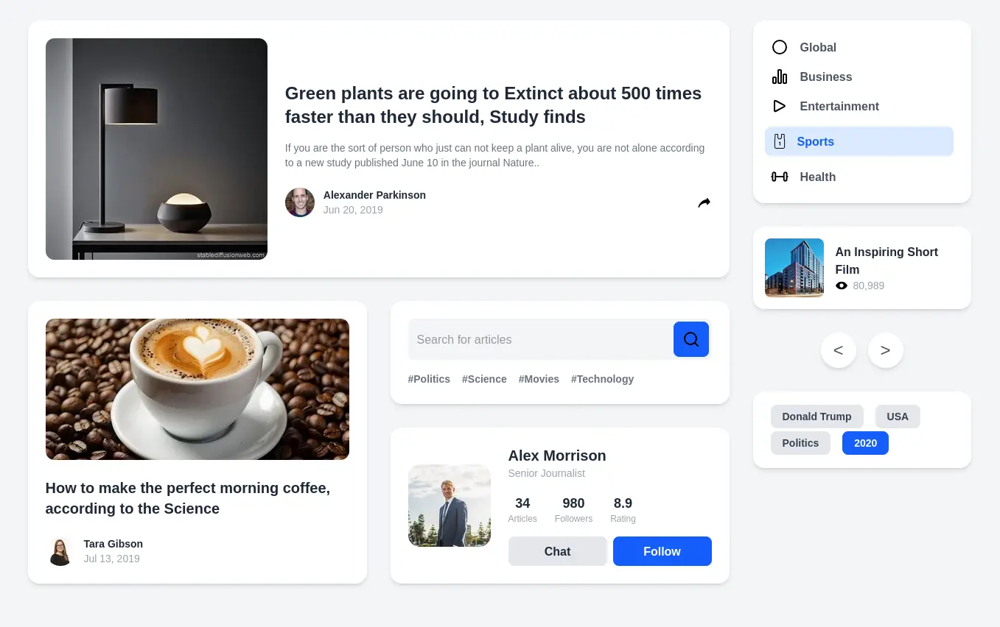

# Múltiples Elementos UI

Entrega de taller tailwindCSS, desarrollada con Next.js y Tailwind CSS. El diseño se basa en una maqueta visual que organiza diversos componentes de manera limpia y eficiente, utilizando `Grid` y `Flexbox`.

## Tecnologías Utilizadas

- **Next.js:** Framework de React para construir aplicaciones web.
- **React:** Biblioteca de JavaScript para construir interfaces de usuario interactivas.
- **Tailwind CSS:** Framework de CSS "utility-first" para un diseño rápido y personalizado sin salir del HTML.

### Prerrequisitos

Asegúrate de tener Node.js instalado en tu máquina.

- [Node.js](https://nodejs.org/) (versión 18.x o superior recomendada)

### Instalación

1.  **Clona el repositorio:**
    ```bash
    git clone https://github.com/tu-usuario/multiples-elementos.git
    cd multiples-elementos
    ```

2.  **Instala las dependencias:**
    ```bash
    npm install
    # o
    yarn install
    # o
    pnpm install
    ```

3.  **Ejecuta el servidor de desarrollo:**
    ```bash
    npm run dev
    # o
    yarn dev
    # o
    pnpm dev
    ```

Abre [http://localhost:3000](http://localhost:3000) en tu navegador para ver el resultado.

4. **Alternativamente visita la URL de despliegue**

    [https://multiples-elementos.vercel.app/](https://multiples-elementos.vercel.app/)

## 📸 Captura de Pantalla


